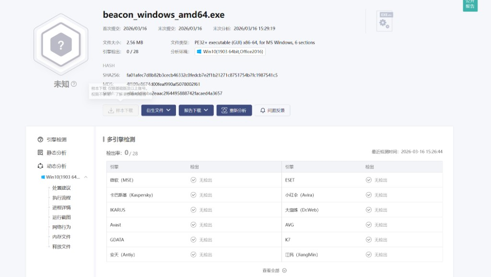
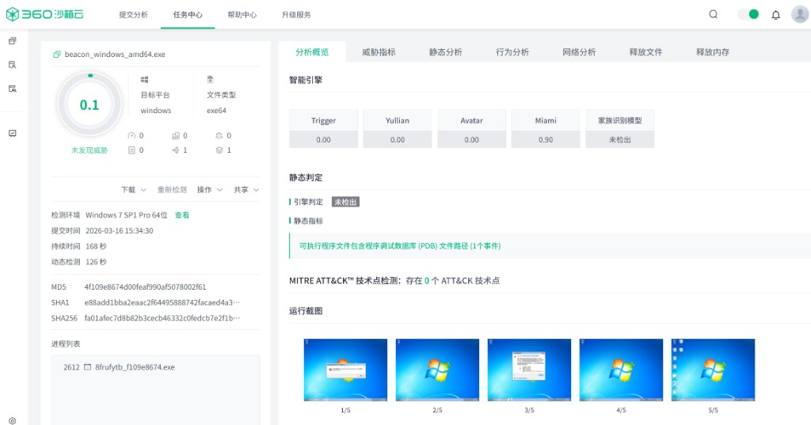
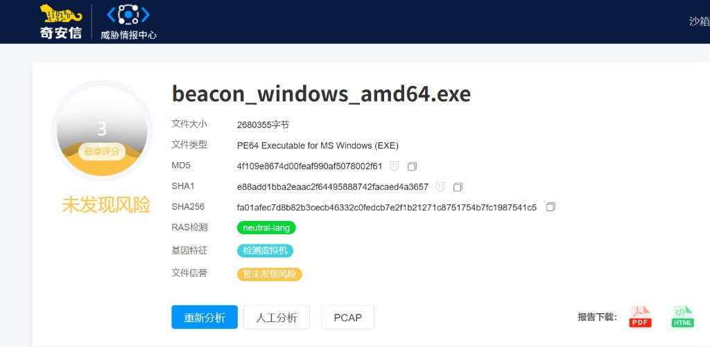
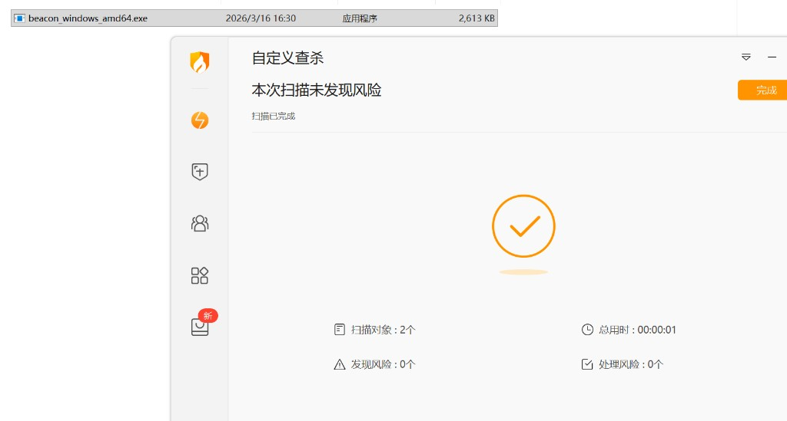
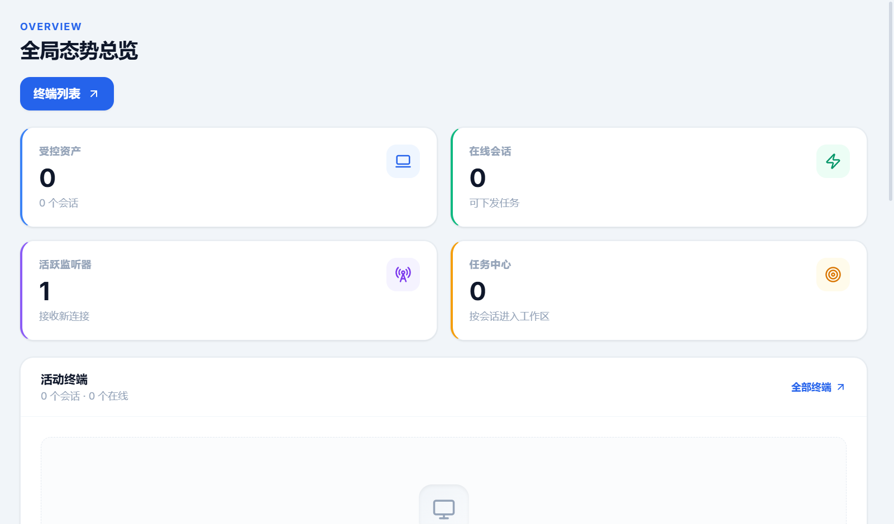
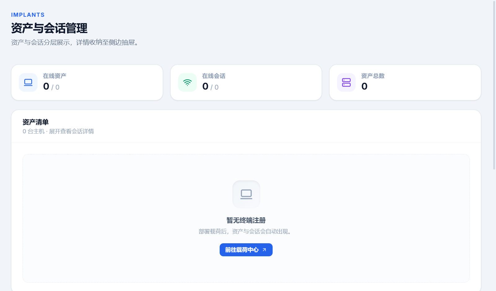
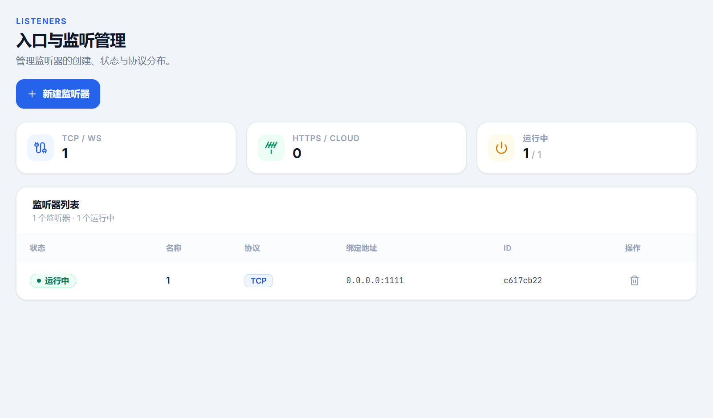
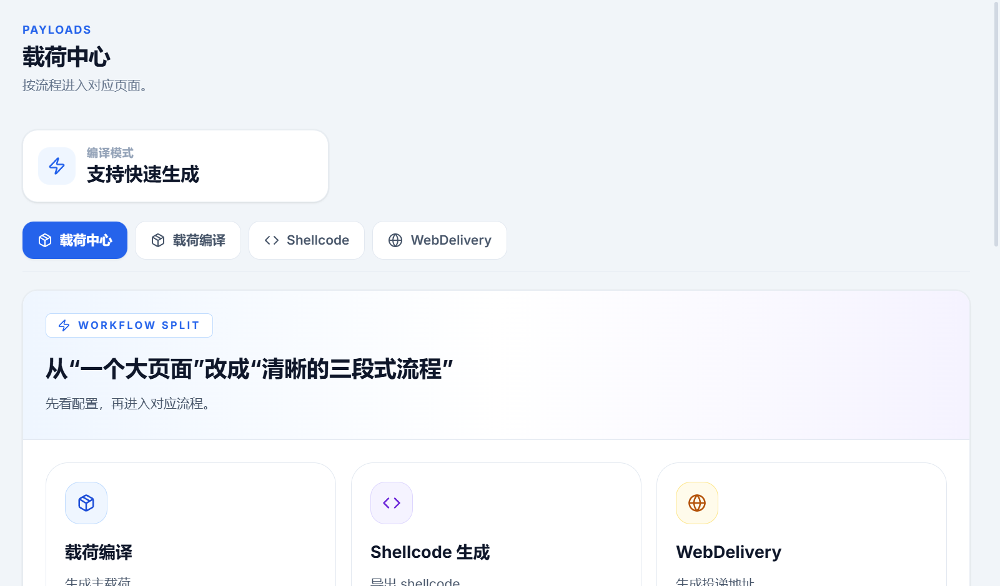
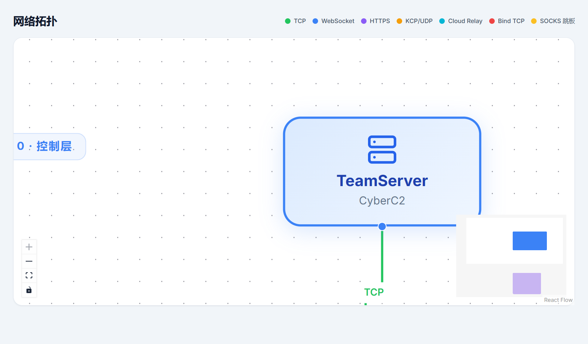
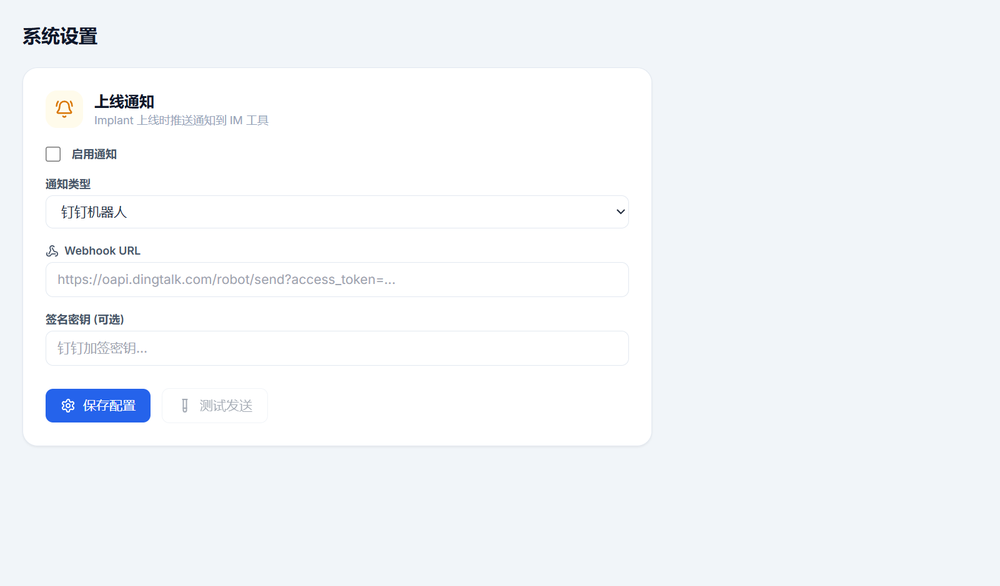

<div align="center">

# 🐚 CyberShell

### 新一代红队指挥控制平台

**Go Teamserver · Rust Implant · React WebUI**

[](https://github.com/frank1q22/cybershell)
[](#平台支持)
[](#免责声明)
[](#内测申请)

---

*CyberShell 是一款面向专业红队的 C2 平台，采用 Go + Rust 双语言架构，在保证极致性能的同时提供企业级规避能力。单文件部署、全中文 Web 界面、开箱即用。*

</div>

---

## 📐 架构总览

```
                          ┌─────────────────────────────────┐
                          │        CyberShell WebUI         │
                          │     React 19 · TailwindCSS      │
                          └───────────────┬─────────────────┘
                                          │ WebSocket / REST
                          ┌───────────────▼─────────────────┐
                          │       Teamserver (Go 1.24)       │
                          │                                   │
                          │  ┌─────────┐ ┌───────┐ ┌──────┐ │
                          │  │ Listener│ │  Task │ │Payload│ │
                          │  │ Manager │ │ Queue │ │Builder│ │
                          │  └────┬────┘ └───┬───┘ └──┬───┘ │
                          │       │          │        │      │
                          │  ┌────▼──────────▼────────▼───┐  │
                          │  │         SQLite (WAL)        │  │
                          │  └────────────────────────────┘  │
                          └──┬────────┬────────┬────────┬───┘
                             │        │        │        │
                     ┌───────▼┐ ┌─────▼──┐ ┌──▼───┐ ┌──▼──┐
                     │  TCP   │ │  HTTPS │ │  KCP │ │ DNS │ ...
                     └───┬───┘ └───┬────┘ └──┬───┘ └──┬──┘
                         │         │         │        │
                     ┌───▼─────────▼─────────▼────────▼───┐
                     │        Implant (Rust)                │
                     │   Beacon (Stage 1) / Stager (Stage 0)│
                     │   AES-256-GCM · X25519 · Anti-Evasion│
                     └─────────────────────────────────────┘
```

---

## ✨ 核心特性

### 🔗 六大通信协议

| 协议 | 特点 | 适用场景 |
|:----:|------|----------|
| **TCP** | 低延迟、高吞吐 | 内网横向 |
| **HTTPS** | TLS 加密、伪装正常流量 | 公网出口 |
| **WebSocket** | 全双工实时通信 | 穿越 WAF/代理 |
| **KCP/UDP** | 超低延迟、抗丢包 | 高丢包环境 |
| **DNS/DoH** | 隐蔽隧道 | 严格出口管控 |
| **Cloud Relay** | OSS/S3 中转 | 无直连场景 |

> 所有协议均使用 **AES-256-GCM + ECDH X25519** 端到端加密，密钥协商基于 HKDF-SHA256。

### 🛡️ 专业级规避能力

<table>
<tr>
<td width="50%">

**反检测**
- 两阶段加载：Stager → Beacon
- 无文件执行：`memfd_create` / Process Hollowing
- 动态 API 解析：PEB 遍历 + DJB2 哈希
- 睡眠混淆：Ekko 风格内存加密
- PE 特征清理：编译时自动擦除

</td>
<td width="50%">

**反分析**
- 反沙箱：VM 检测 / 资源检查 / 进程扫描
- 反调试：多重检测机制联动
- 进程伪装：Linux 下伪装为内核线程
- Nginx 伪装：Stager 返回逼真 404 页面
- 心跳抖动：可配置随机化

</td>
</tr>
</table>

### 🧪 实测免杀效果

> 以下为 `beacon_windows_amd64.exe` 在主流云沙箱的检测结果（2026-03-16）

<table>
<tr>
<td align="center" width="25%">
<br/>
<b>微步云沙箱</b><br/>
引擎检出：<b>0 / 28</b>
</td>
<td align="center" width="25%">
<br/>
<b>360 云沙箱</b><br/>
威胁评分：<b>0.1</b> · 未发现威胁
</td>
<td align="center" width="25%">
<br/>
<b>奇安信云沙箱</b><br/>
恶意评分：<b>3</b> · 未发现风险
</td>
<td align="center" width="25%">
<br/>
<b>火绒安全</b><br/>
本地查杀：<b>未发现风险</b>
</td>
</tr>
</table>

### 🎯 丰富的 Implant 能力

```
┌─ 基础能力 ──────────────────────────────────────────────┐
│  命令执行 · 文件管理 · 进程管理 · 系统信息 · 截图       │
│  剪贴板 · 键盘记录 · 凭据提取 · 磁盘列表               │
├─ 内存执行 ──────────────────────────────────────────────┤
│  Shellcode 注入 · Execute Assembly (.NET)               │
│  Inline PE (BOF) · CLR 加载                              │
├─ 网络代理 ──────────────────────────────────────────────┤
│  SOCKS5 代理 · 端口转发 · HTTP 代理隧道                  │
├─ 高级操作 ──────────────────────────────────────────────┤
│  心跳调节 · 自删除 · 后台执行 · 进程终止                 │
└──────────────────────────────────────────────────────────┘
```

### 🖥️ 全功能 Web 管理界面

现代化 React WebUI，全中文界面，覆盖红队行动全流程：

| 模块 | 功能说明 |
|------|----------|
| **仪表盘** | 实时总览：在线会话、监听器状态、任务统计、系统健康度 |
| **资产会话** | Implant 管理，支持按主机聚合视图 |
| **任务工作区** | 交互式终端 + 文件管理器 + 任务下发，一站式操控 |
| **监听器管理** | 一键创建/启停 TCP / HTTPS / WS / KCP / DNS / Cloud 监听器 |
| **载荷中心** | 在线编译 Beacon/Stager，支持 Shellcode 导出、WebDelivery |
| **网络拓扑** | 可视化 Teamserver → Listener → Implant 网络关系图 |
| **军火库** | 分类管理渗透工具，一键推送到目标 Implant |
| **MSF 集成** | 内嵌 Metasploit Console，支持代理注入 |
| **插件系统** | 上传 .dll / .so 插件并远程执行 |
| **审计日志** | 全操作审计记录，支持导出 |
| **通知推送** | 钉钉 / 企业微信 / 飞书上线通知 |

<div align="center">

#### 全局态势总览


#### 资产与会话管理


#### 入口与监听管理


#### 载荷中心


#### 网络拓扑可视化


#### 系统设置 · 上线通知


</div>

---

## 🚀 部署方式

### 单文件部署，开箱即用

CyberShell 发布版为**单个可执行文件**，内嵌 Web 前端和预编译 Payload 模板，无需在目标服务器安装任何依赖。

```
📦 CyberShell-windows-amd64.zip
├── CyberShell.exe          # 单文件服务端（内嵌 WebUI + Payload 模板）
└── config.yaml             # 配置文件

📦 CyberShell-linux-amd64.tar.gz
├── cybershell               # 单文件服务端
├── config.yaml              # 配置文件
├── cybershell.service       # systemd 服务单元
└── setup.sh                 # 一键初始化脚本
```

### 快速启动

```bash
# Linux
chmod +x cybershell
./cybershell config.yaml

# Windows
CyberShell.exe config.yaml
```

启动后访问 `https://<服务器IP>:8443` 即可使用 Web 管理界面。

---

## 📊 平台支持

### Teamserver

| 平台 | 架构 | 状态 |
|:----:|:----:|:----:|
| Windows | x86_64 | ✅ |
| Linux | x86_64 | ✅ |

### Implant

| 目标平台 | 架构 | 状态 |
|:--------:|:----:|:----:|
| Windows | x86_64 | ✅ |
| Windows | x86 (32-bit) | ✅ |
| Linux | x86_64 | ✅ |
| Linux | x86 (32-bit) | ✅ |

---

## 🔧 技术栈

| 组件 | 技术选型 | 说明 |
|------|----------|------|
| **Teamserver** | Go 1.24 | Gin · gorilla/websocket · go-sqlite3 |
| **Implant** | Rust | tokio · aes-gcm · x25519-dalek · serde |
| **Web UI** | React 19 | Vite 6 · TailwindCSS · xterm.js · ReactFlow |
| **数据库** | SQLite | WAL 模式，零配置 |
| **加密** | AES-256-GCM | ECDH X25519 密钥交换 · HKDF-SHA256 派生 |

---

## 📋 版本规划

| 版本 | 状态 | 主要内容 |
|:----:|:----:|----------|
| v1.0-beta | 🔶 当前 | 核心 C2 功能、6 大协议、Web 管理界面、规避体系 |
| v1.0 | 🔜 计划中 | 稳定性优化、文档完善、多操作员协作 |
| v1.1 | 📋 规划中 | 更多 Implant 能力、自定义协议扩展 |
| v2.0 | 💡 展望 | macOS Implant、移动端管理、AI 辅助决策 |

---

## 🧪 内测申请

CyberShell 目前处于**封闭内测**阶段，面向专业红队成员和安全研究人员开放。

### 如何参与内测

1. **加入内测群** — 扫描下方二维码或联系管理员获取邀请
2. **获取激活码** — 群内提交机器 ID 后发放
3. **下载部署** — 获取最新内测构建包
4. **反馈问题** — 在群内或通过 Issues 提交 Bug 和建议

<!-- 
  内测群二维码 — 替换为实际二维码图片
  
  <div align="center">
    
    <p>扫码加入 CyberShell 内测群</p>
  </div>
-->

> **内测群联系方式**：请通过 Issues 留言或发送邮件至 `your-email@example.com` 获取入群方式。

### 内测须知

- 内测版本仅供**授权安全测试与研究**使用
- 请勿将内测构建包二次分发
- 遇到 Bug 请及时反馈，帮助我们改进产品
- 内测期间功能可能频繁更新，请关注群内公告

---

## ⚠️ 免责声明

**CyberShell 仅供合法授权的安全测试与安全研究用途。**

使用者必须在获得目标系统所有者明确书面授权的前提下使用本工具。未经授权对任何系统使用本工具属于违法行为，由此产生的一切法律责任由使用者自行承担。开发团队不对任何滥用行为负责。

---

<div align="center">

**CyberShell** — *为专业红队而生*

Copyright &copy; 2025-2026 CyberShell Team. All rights reserved.

</div>
